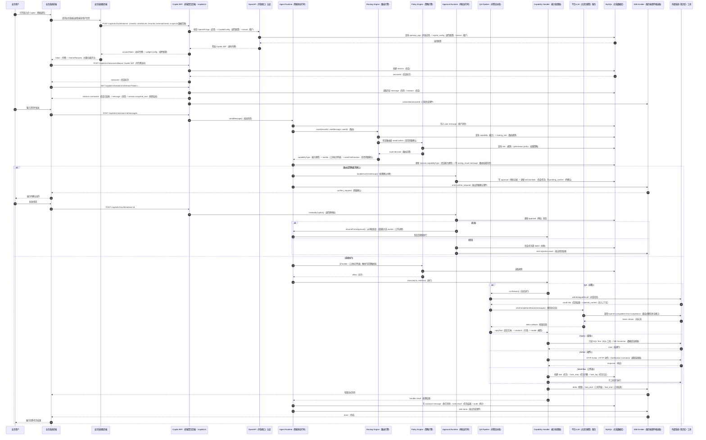
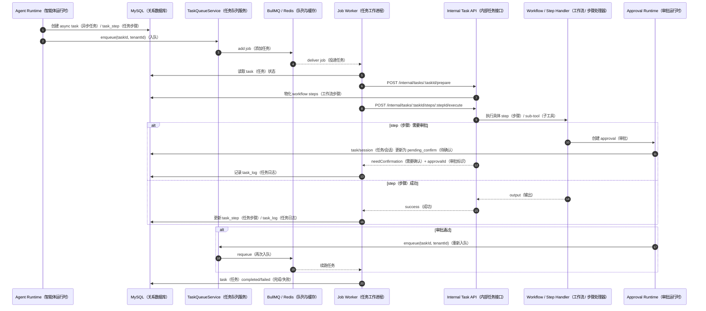

# 业务系统嵌入式 Copilot（智能副驾）时序图

## 1. 主时序图

## 2. 异步 Workflow/Worker 续跑时序

## 3. 时序说明

- 嵌入式 Copilot（智能副驾）本质是 `Copilot BFF`（Backend For Frontend，前端聚合后端），不自带独立运行时；会话、消息、SSE（Server-Sent Events，服务端发送事件）、确认都复用 `AgentRuntimeService`（智能体运行时服务）与 `ApprovalRuntimeService`（审批运行时服务）。
- 换票入口依赖 `openapi_app`（开放应用）与 `copilot_config`（副驾配置），说明 Copilot（智能副驾）是建立在 OpenAPI（开放接口）接入应用之上的能力扩展。
- SSE（Server-Sent Events，服务端发送事件）连接先回放历史快照，再订阅实时事件；前端应先连 `stream`（流式通道），再发 `messages`（消息）。
- QA（Question Answering，问答）能力当前真实链路是 `wiki recall -> platform LLM stream`（wiki 召回到平台 LLM 流式生成）；SSE 的 `delta`（增量片段）来自平台 LLM（Large Language Model，大语言模型）的流式输出，不再是本地 `splitText`（文本切分）模拟流式。
- 审批通过后有两条恢复路径：同步 `resumeFromApproval()`（从审批恢复），或异步重新入队 `job-worker`（任务工作进程）续跑。
- `workflow`（工作流）的长任务会落到 `task/task_step/task_log`（任务/任务步骤/任务日志），因此业务系统可以通过 `/copilot/v1/tasks/:id` 持续查询进度。
- 管理后台问答测试页走 `/api/v1/knowledge/dialogue/qa-preview`，与 Runtime（运行时）共用 `QaPipelineService`（问答流水线服务），因此图中的 QA（问答）两阶段链路同样适用于测试页。
