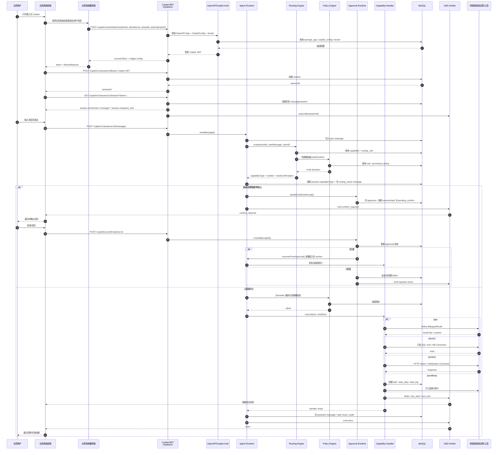
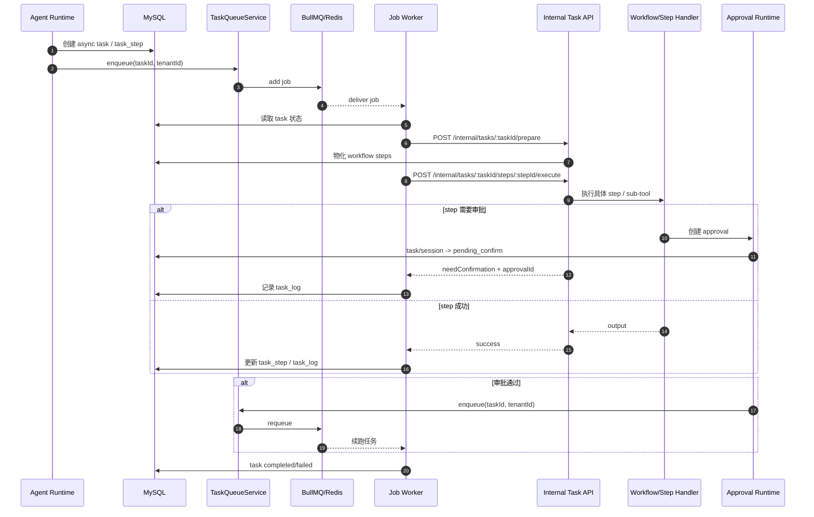

# 业务系统嵌入式 Copilot 时序图

## 1. 主时序图

## 2. 异步 Workflow/Worker 续跑时序

## 3. 时序说明

- 嵌入式 Copilot 本质是 `Copilot BFF`，不自带独立运行时；会话、消息、SSE、确认都复用 `AgentRuntimeService` 与 `ApprovalRuntimeService`。
- 换票入口依赖 `openapi_app` 与 `copilot_config`，说明 Copilot 是建立在 OpenAPI 接入应用之上的能力扩展。
- SSE 连接先回放历史快照，再订阅实时事件；前端应先连 `stream`，再发 `messages`。
- 审批通过后有两条恢复路径：同步 `resumeFromApproval()`，或异步重新入队 `job-worker` 续跑。
- `workflow` 的长任务会落到 `task/task_step/task_log`，因此业务系统可以通过 `/copilot/v1/tasks/:id` 持续查询进度。
