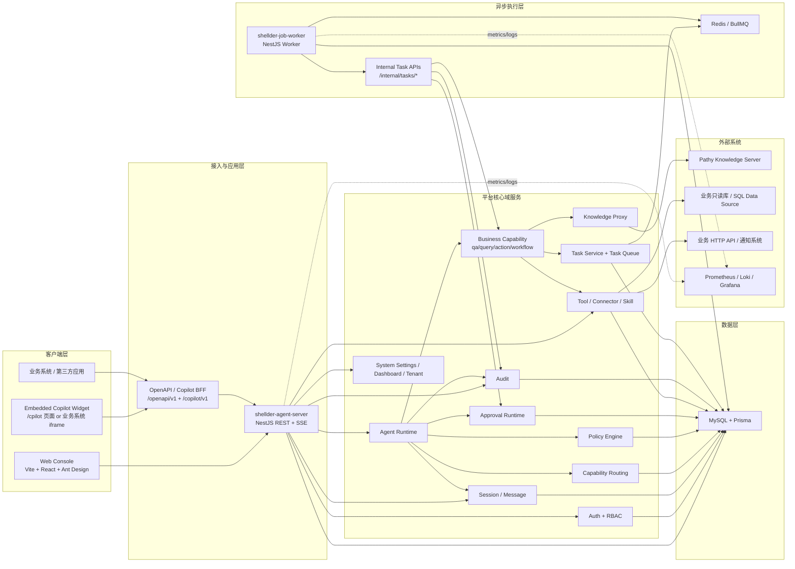
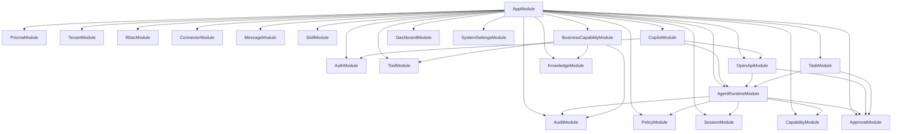
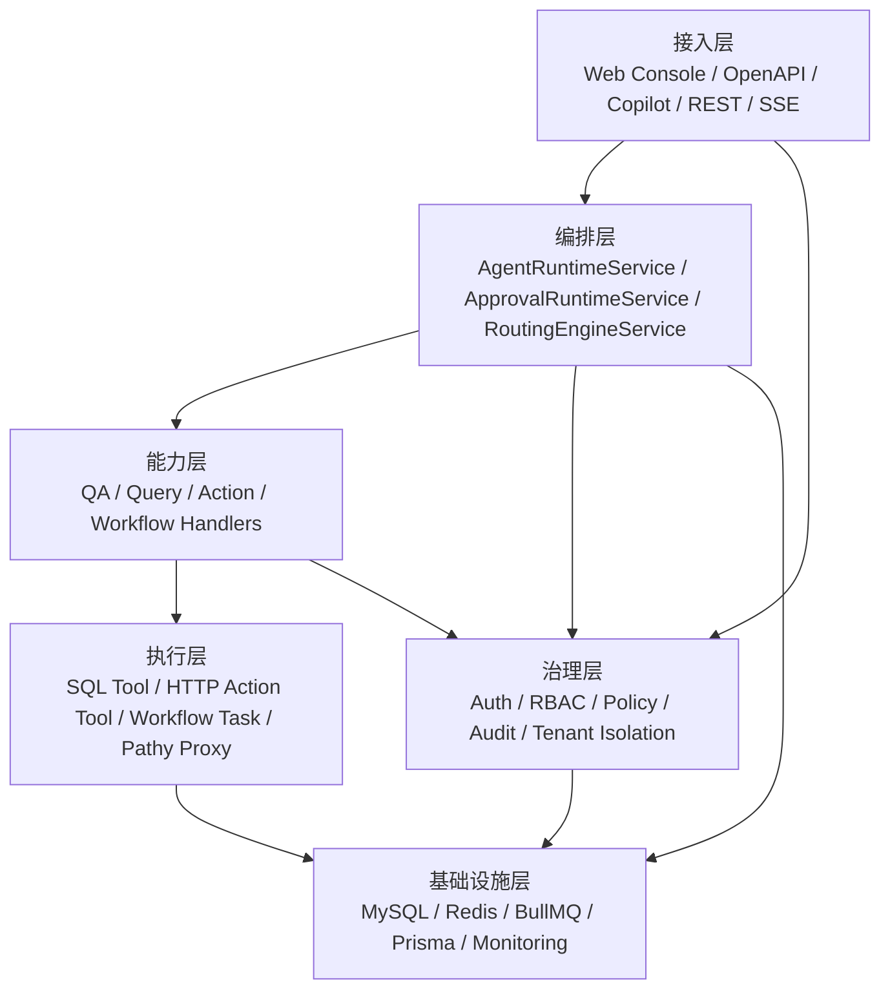

# Shellder Agent 系统架构图

## 1. 总体架构

## 2. 后端模块关系

## 3. 关键职责分层

## 4. 架构解读

- `shellder-web-console` 是管理后台与预览前端，走 `/api/v1/*` 和 `/copilot/v1/*`。
- `shellder-agent-server` 是统一控制面与运行时入口，负责认证、会话、编排、审批、审计、OpenAPI、Copilot BFF。
- `shellder-job-worker` 只负责异步消费、状态机推进、重试与续跑；真实能力执行通过 `agent-server` 的 `/internal/tasks/*` 完成。
- `qa` 能力不在本地做向量检索，而是通过 `KnowledgeProxyService` 代理到 `Pathy`。
- `query` / `action` / `workflow` 通过 Tool + Connector 落到只读数据库或外部 HTTP 系统。
- `Policy` 与 `Approval` 嵌入 Runtime 主链路，在工具执行前决定放行、拒绝或转人工确认。
- `MySQL` 存放业务主数据、会话消息、任务、规则、审批、审计、Copilot 配置；`Redis` 承载 BullMQ 队列与异步任务。
