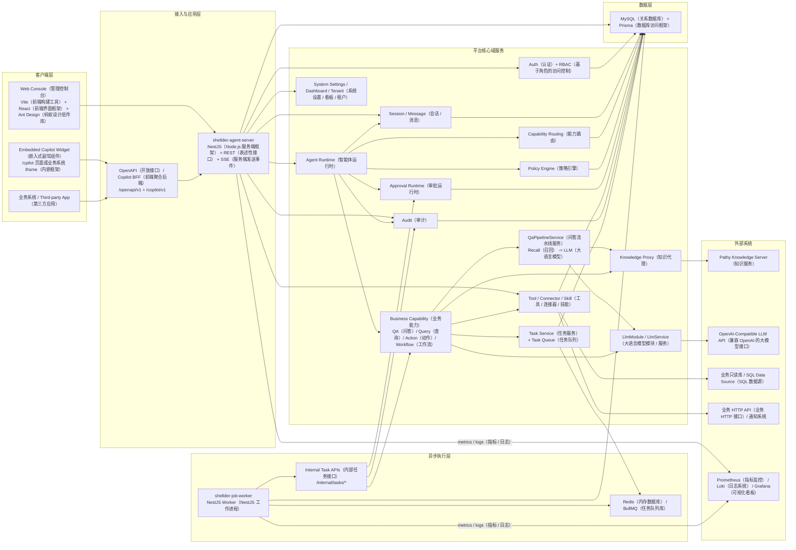
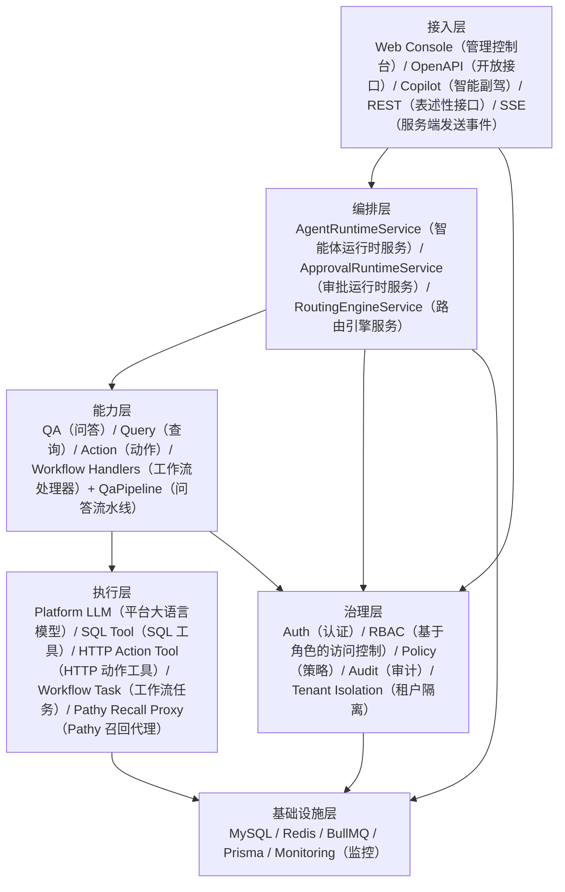

# Shellder Agent（智能体平台）系统架构图

## 1. 总体架构

## 2. 后端模块关系

```mermaid
flowchart TD
    App["AppModule（应用模块）"]

    App --> Prisma["PrismaModule（Prisma 数据库访问模块）"]
    App --> Auth["AuthModule（认证模块）"]
    App --> Audit["AuditModule（审计模块）"]
    App --> Tenant["TenantModule（租户模块）"]
    App --> Rbac["RbacModule（角色权限模块）"]
    App --> Policy["PolicyModule（策略模块）"]
    App --> Connector["ConnectorModule（连接器模块）"]
    App --> Tool["ToolModule（工具模块）"]
    App --> Session["SessionModule（会话模块）"]
    App --> Message["MessageModule（消息模块）"]
    App --> Task["TaskModule（任务模块）"]
    App --> Capability["CapabilityModule（能力模块）"]
    App --> Skill["SkillModule（技能模块）"]
    App --> Knowledge["KnowledgeModule（知识模块）"]
    App --> Approval["ApprovalModule（审批模块）"]
    App --> Runtime["AgentRuntimeModule（智能体运行时模块）"]
    App --> LLM["LlmModule（大语言模型模块）"]
    App --> BizCap["BusinessCapabilityModule（业务能力模块）"]
    App --> OpenAPI["OpenApiModule（开放接口模块）"]
    App --> Copilot["CopilotModule（智能副驾模块）"]
    App --> Dashboard["DashboardModule（看板模块）"]
    App --> Settings["SystemSettingsModule（系统设置模块）"]

    Runtime --> Policy
    Runtime --> Audit
    Runtime --> Capability
    Runtime --> Session
    Runtime --> Approval

    BizCap --> LLM
    BizCap --> Knowledge
    BizCap --> Tool
    BizCap --> Audit

    Copilot --> OpenAPI
    Copilot --> Runtime
    Copilot --> Auth

    OpenAPI --> Runtime
    OpenAPI --> Approval

    Task --> Runtime
    Task --> Approval
```

## 3. 关键职责分层

## 4. 架构解读

- `shellder-web-console`（管理控制台）是管理后台与预览前端，技术栈为 Vite（前端构建工具）、React（前端界面框架）与 Ant Design（蚂蚁设计组件库），走 `/api/v1/*` 和 `/copilot/v1/*`。
- `shellder-agent-server`（智能体服务端）是统一控制面与运行时入口，负责认证、会话、编排、审批、审计、OpenAPI（开放接口）、Copilot BFF（前端聚合后端）。
- `shellder-job-worker`（任务工作进程）只负责异步消费、状态机推进、重试与续跑；底层依赖 BullMQ（任务队列库）与 Redis（内存数据库），真实能力执行通过 `agent-server`（智能体服务端）的 `/internal/tasks/*` 完成。
- `LlmModule`（大语言模型模块）提供平台级 OpenAI-compatible（兼容 OpenAI）模型接入，配置入口是 `/api/v1/settings/llm`，配置保存在平台侧 `system_config`（系统配置），不代理 `pathy`（知识服务）的 LLM（Large Language Model，大语言模型）设置。
- `qa`（问答）能力已经改为两阶段：`KnowledgeProxyService.dialogueRecall -> QaPipelineService -> LlmService`，即“知识召回服务 -> 问答流水线服务 -> 大语言模型服务”。也就是说 `pathy`（知识服务）只负责召回，最终回答由平台 LLM（大语言模型）生成。
- `query`（查询）/ `action`（动作）/ `workflow`（工作流）通过 Tool（工具）+ Connector（连接器）落到只读数据库或外部 HTTP（HyperText Transfer Protocol，超文本传输协议）系统。
- `Policy`（策略）与 `Approval`（审批）嵌入 Runtime（运行时）主链路，在工具执行前决定放行、拒绝或转人工确认。
- 管理端 `knowledge/recall-test`（召回测试）现在走 `qa-preview`（问答预览）两阶段链路，与 Runtime（运行时）的 QA（问答）行为保持一致。
- `MySQL`（关系数据库）存放业务主数据、会话消息、任务、规则、审批、审计、Copilot（智能副驾）配置及平台 LLM（大语言模型）配置；`Redis`（内存数据库）承载 BullMQ（任务队列库）队列与异步任务；监控侧使用 Prometheus（指标监控）、Loki（日志系统）与 Grafana（可视化看板）。
