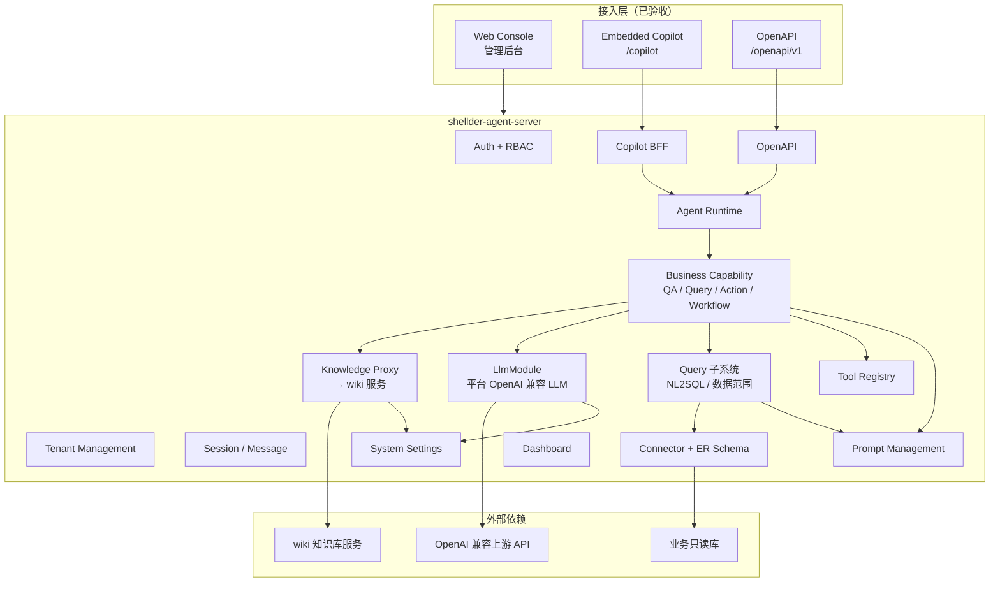

# 架构设计 — V1 已完成

> 依据 [`project-analysis/agent-platform-架构设计.md`](../project-analysis/agent-platform-架构设计.md) 裁剪；仅描述 V1 已验收模块及其依赖关系。

---

## 1. 架构结论

`shellder-agent` 采用：

- 前后端分离
- **模块化单体**（`shellder-agent-server`）
- 独立异步 Worker（`shellder-job-worker`）
- MySQL + Redis（BullMQ）
- REST + SSE
- JWT + RBAC + 租户隔离

---

## 2. 总体架构（V1 已完成部分）

**说明**：**Policy / 规则**、**审批中心**、**任务中心**、**Capability Routing**、**Audit** 管理面均已产品化（2026-06）；Skill 管理 UI 仍为实验中。

---

## 3. 请求处理链路（V1 固定）

与会话调试、Copilot、OpenAPI 共用：

1. 接入层创建或复用 **Session**，用户消息写入 **Message**
2. **Agent Runtime** 装配上下文，调用 **Capability Routing**（两阶段 `routeFull`）得到能力类型与能力内 toolIds
3. Runtime 按能力类型调用 **BusinessCapabilityModule** 对应 Handler
4. **问答型**：wiki `dialogue/recall` → **平台 LLM**（`QaPipelineService`）
5. **查询型**：加载已发布 ER → **NL2SQL（LLM）** → **SqlTool 只读执行** → **结果解读（LLM）**
6. Tool 执行前经 **Policy**；需确认时经 **Approval** 中断（管理端 **审批中心** + Copilot 内联确认卡片）
7. 结果写入 Message；流式阶段经 **SSE** 推送

---

## 4. 平台服务层（V1 已完成职责）

| 模块 | 路径 | V1 职责 |
|------|------|---------|
| Session | `session/` | 会话 CRUD、上下文装配 |
| Message | `message/` | 消息持久化、时间线 |
| Agent Runtime | `agent-runtime/` | 编排、SSE、确认中断 |
| Business Capability | `business-capability/` | 四类 Handler + QaPipeline |
| LlmModule | `llm/` | 平台 LLM 配置与调用 |
| Prompt | `prompt/` | 模板 SSOT、Resolver |
| Knowledge | `knowledge/` | wiki 代理、知识库元数据 |
| Connector | `connector/` | 连接器 + ER 抽取/发布 |
| Query | `query/` | NL2SQL、数据范围、结果解读 |
| Tool | `tool/` | Tool 注册；`http_query` / HTTP Invoker；SQL/NL2SQL 测试 API |
| Tenant | `tenant/` | 租户 CRUD、隔离配置 |
| RBAC | `rbac/` + `auth/` | 用户/角色/权限、JWT |
| System Settings | `system-settings/` | 基础/模型/通知配置 |
| Dashboard | `dashboard/` | 工作台聚合 |
| Copilot | `copilot/` | 配置 CRUD + `/copilot/v1` BFF（含 `routingMode` auto/pinned/hybrid） |
| OpenAPI | `openapi/` | `/openapi/v1` + 应用管理 |
| Capability Routing | `capability/` | 两阶段路由、规则 AI/条件测试/优化、能力自动补齐 |
| Policy | `policy/` | 显式规则 CRUD、Policy 评估、`rule_hit` 留痕 |
| Approval | `approval/` | 待确认 CRUD、Runtime/Copilot 审批运行时 |
| Audit | `audit/` | 三类审计采集 + 风险动作聚合查询 |

---

## 5. 连接器、工具与查询型（V1 固定）

### 5.1 连接器双入口

| type | 管理入口 |
|------|----------|
| `db_readonly` | 『查询型』配置 → `/query/db-connectors` |
| `http` / `notification` | 连接器管理 → `/connectors` |

### 5.2 查询型（NL2SQL）

- **一个 `db_readonly` 连接器 = host:port + 一个逻辑库（database）**
- 查询型 **固定只读 SQL**，不经 HTTP 查数
- ER 图 **已发布版**（`connector_db_metadata.er_diagram_published`）为 NL2SQL 权威输入
- 执行安全：`SqlToolService` 只读校验、黑名单、行数/时长限制

### 5.3 HTTP 类 Tool

- **`ToolType.http_query`**：HTTP 业务只读查询，config 存 `httpQuery`；**能力归属 action**
- **`action` / `notification`**：config 存 `http`；统一经 `HttpToolInvoker`
- **`ToolType.query`**：只读 SQL，config 存 `sql`；能力归属 query，菜单在『查询型』配置

详见 [`modules/12-工具管理.md`](./modules/12-工具管理.md)、[`capabilities/查询型能力.md`](./capabilities/查询型能力.md)。

---

## 6. 知识与 LLM 边界（V1 固定）

| 能力 | 负责方 |
|------|--------|
| 知识存储、召回、四层内容、媒体 | **wiki 知识库服务**（平台代理 `/api/v1/knowledge/*`） |
| 问答最终自然语言 | **平台 LLM**（`system_config` / `/api/v1/settings/llm`） |
| LLM 提示词正文 | **Prompt Management**（`published` 版本） |

**禁止**：pathy/wiki 侧 LLM 作为生产主推理；禁止 Runtime 硬编码 Prompt 正文（见 `06-实施约束-已落地.md`）。

---

## 7. 技术栈（现网）

| 层 | 选型 |
|----|------|
| 前端 | Vite、React 19、TypeScript、Tailwind CSS、Ant Design |
| 后端 | NestJS、Prisma、MySQL 8、Redis、BullMQ |
| 部署 | Docker Compose（见 `shellder-agent` 根目录） |

> 初始方案写 Next.js；现网为 Vite + React Router，以代码为准。

---

## 8. 对照初始架构

| 初始 § | V1 状态 |
|--------|---------|
| §4.1 接入层三种入口 | ✅ Web Console、Copilot、OpenAPI |
| §4.2 平台服务层 | ✅ 核心模块已落地；**Capability Routing / Policy / Approval / Task** 已产品化；Skill 管理 UI 实验中 |
| §4.5 知识与规则 | ✅ 知识（wiki 代理）；**规则** 独立菜单（`/rules`、`/rule-hits`）已产品化 |
| §4.6 治理层 | ✅ Auth/RBAC/Tenant/Audit；**审批中心** 已产品化 |
| §6 服务划分 | ✅ 三端工程名与初始实施规格一致 |
