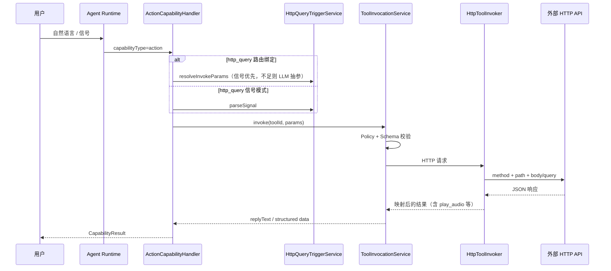

# 操作型能力 — V1 已完成

> 操作型业务能力说明；**以现网实现为准**。

---

## 1. 能力定位

- 单步调用外部 HTTP 接口或内部 Tool，可含读写与副作用
- V1 包含两类 Tool：
  - **`action` / `notification`**：通用 HTTP 操作（`config.http`）
  - **`http_query`**：HTTP 业务只读查询（`config.httpQuery`），**能力归属仍为 action**
- 与 **`ToolType.query`（NL2SQL）** 无关，后者走 **查询型** 能力与菜单

---

## 2. 配置期（管理台）

| 步骤 | 菜单 | 产出 |
|------|------|------|
| 1 | **连接器管理** → 连接器列表 | `connector`（`type=http`） |
| 2a | 工具管理 / **查询工具** | `tool`（`type=http_query`）+ invoke/response 映射 |
| 2b | 工具管理 / **工具列表** | `tool`（`type=action` 或 `notification`）+ HTTP 配置 |
| 3 | 查询工具页 | **AI 润色** / **添入预制** / **invoke** / **parse-signal** / **导出对接文档** |
| 4 | 工具列表页 | **test** 调用调试 |
| 5（可选） | 能力路由 → 路由规则 | action 能力绑定 `toolIds` / `toolKind=http_query` |

**可选**：未绑路由时 Runtime 可走 **信号模式**（`http_query`）。

---

## 3. 运行期流水线



---

## 4. E2E 验收（业务调试 / 能力演示）

**入口**：业务调试 → 能力演示（`/capabilities`），选择 **操作型**，定向创建会话。

### 4.1 HTTP 业务查询（http_query）

**前置**：

1. **连接器管理** 已配置 HTTP 连接器；**查询工具** 已启用 `http_query` Tool（见 [`modules/12-工具管理.md`](../modules/12-工具管理.md)）
2. Prompt 目录 `action.http_query.catalog` 已 seed（或能力路由已绑定 toolIds）

**方式 A — 信号模式**（推荐联调）：

输入含工具码与参数的自然语言，或 LLM 输出形如：

```text
[查询工具:your_tool_code {"orderId":"12345"}]
```

**方式 B — 路由绑定**：

在能力路由中为 action 能力绑定 `http_query` toolIds；输入与 Tool 描述/规则 conditions 匹配的问句（**无需信号**，Runtime 经 LLM 抽参）。

**期望**：`CapabilityResult.status=success`，`data.text` 含映射后的回复；`response.type=play_audio` 时含 `audio_url` 等字段；SSE 可能出现 `tool_resolve` 事件。

### 4.2 通用 action Tool

**前置**：工具列表中已启用 `action` Tool，且 Copilot/租户开通 `action` 能力。

**输入**：与 Tool 描述匹配的指令（如「创建工单」「更新状态」）。

**期望**：invoke 成功或进入 **待确认**（高风险 Policy）；结果区展示 `data.text` 或审批 `approvalId`。

---

## 5. 与查询型能力的区别

| 维度 | 查询型（`query` 能力） | 操作型（含 `http_query`） |
|------|------------------------|-------------------------|
| Tool 类型 | `ToolType.query` | `http_query` / `action` / `notification` |
| 配置菜单 | 『查询型』配置 | 连接器管理 + 工具管理 |
| 执行 | NL2SQL + 只读 SQL | HTTP Invoker |
| 数据源 | 业务库 SELECT | 外部 HTTP API |
| 对接交付 | ER / 数据范围 | **导出对接文档**（Markdown） |

---

## 6. 实现差异

|----------|------|
| HTTP 查询与 SQL 问数混谈 | **`http_query`** 独立 Tool 类型，仍归 **action** 能力 |
| 连接器 UI 实验中 | **连接器管理** 已产品化（`/connectors`） |
| 手工配置 Tool | 支持 **AI 润色**、**预制模板**、**导出对接文档** |
| 仅信号触发 http_query | 路由绑定 + **LLM 自然语言抽参** |

---

## 关联文档

- [modules/14-连接器管理.md](../modules/14-连接器管理.md)
- [modules/12-工具管理.md](../modules/12-工具管理.md)
- [modules/13-能力路由.md](../modules/13-能力路由.md)
