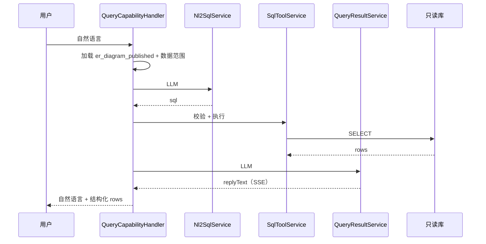

# 查询型能力 — V1 已完成

> 对照 [`project-analysis/capabilities/query/查询型能力-详细方案.md`](../project-analysis/capabilities/query/查询型能力-详细方案.md) 与功能清单 §5.2；**以现网实现为准**。

---

## 1. 能力定位

- 自然语言 → 受控只读 SQL → 结构化结果 → LLM 解读回复
- V1 **固定**经业务库只读 SQL，不经 HTTP 查数
- 平台不预置业务对象；由接入方配置连接器、ER、Query Tool

---

## 2. 配置期（管理台 『查询型』配置）

| 步骤 | 菜单 | 产出 |
|------|------|------|
| 1 | 数据库连接器 | `connector`（`db_readonly`），SELECT 1 连通 |
| 2 | 库表 ER 图 | `connector_db_metadata`：抽取 → LLM 草稿 → 编辑 → **发布** |
| 3 | 数据范围（ER 内） | 限制字段/列映射（`ErDataScopeService`） |
| 4 | 数据库连接工具 | `tool`（`type=query`）绑定连接器 |
| 5 | 查询测试 | NL2SQL 预览 / SQL 测试 / E2E 预览 |

**前置条件**：Runtime 查询前必须有 **已发布 ER**（`er_diagram_published`），否则拒绝并提示配置。

---

## 3. 运行期三步流水线

| 步骤 | Prompt keys | 代码 |
|------|-------------|------|
| NL2SQL | `query.nl2sql.system` / `.user` | `query/nl2sql.service.ts` |
| 执行 | — | `tool/sql-tool.service.ts` |
| 解读 | `query.result.system` / `.user` | `query/query-result.service.ts` |

---

## 4. 安全与范围

- SQL 只读校验（禁止 DML/DDL）
- 表/字段 **黑名单**（相对初始方案「白名单」的实现差异）
- ER **数据范围**列映射限制可见字段
- 最大行数、最大执行时长（Tool / 连接器 config）

---

## 5. API（管理端测试）

| 用途 | 方法 | 路径 |
|------|------|------|
| 连接器 SQL 测试 | POST | `/api/v1/connectors/:id/sql-test` |
| Tool NL2SQL 预览 | POST | `/api/v1/tools/:id/nl2sql-preview` |
| Tool E2E 预览 | POST | `/api/v1/tools/:id/query-e2e-preview` |
| ER 抽取 | POST | `/api/v1/connectors/:id/introspect` |
| ER 发布 | PUT | `/api/v1/connectors/:id/er-diagram/publish` |

---

## 6. 代码落点

| 组件 | 路径 |
|------|------|
| Handler | `business-capability/query.handler.ts` |
| Query 模块 | `query/query.module.ts` |
| ER | `connector/er-diagram.service.ts` |
| 前端 ER 画布 | `shellder-web-console` → `connectors/db-schema/`（React Flow） |

---

## 7. 对照初始详细方案

| 初始方案 | V1 现网 |
|----------|---------|
| 一连接器一库三元组 | ✅ `target` + `config.properties.database` |
| SELECT 1 连通 | ✅ |
| 独立 ER 菜单 | ✅ `/query/db-er` |
| 三步流水线含 LLM 解读 | ✅ `QueryResultService` 已实现 |
| 表白名单 | ⚠️ 现为 **黑名单** + 数据范围 |
| SQL Tool 独立菜单 | 合并为 **数据库连接工具** |

Query Tool **不参与 SQL 生成**，仅作路由与执行通道（与初始 §5.6 一致）。
