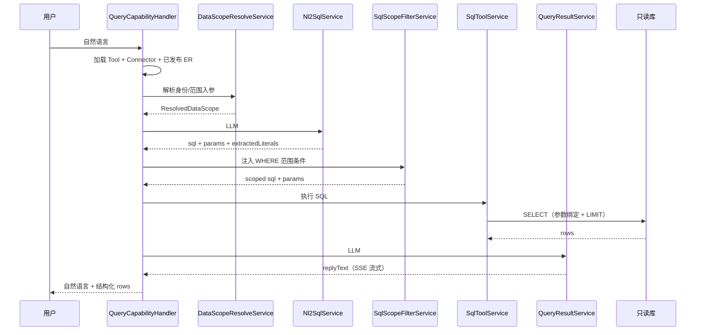

# 查询型能力 — V1 已完成

> 查询型（NL2SQL）业务能力说明；**以现网实现为准**。

---

## 1. 能力定位

- 自然语言 → 受控只读 SQL → 结构化结果 → LLM 解读回复
- V1 **固定**经业务库只读 SQL，不经 HTTP 查数
- 平台不预置业务对象；由接入方配置连接器、ER、Query Tool

---

## 2. 配置期（管理台 『查询型』配置）

| 步骤 | 菜单 | 产出 |
|------|------|------|
| 1 | 数据库连接器 | `connector`（`db_readonly`），SELECT 1 连通 |
| 2 | 库表 ER 图 | `connector_db_metadata`：抽取 → LLM 草稿 → 编辑 → **发布** |
| 3 | 数据范围（ER 内） | 限制字段/列映射（`ErDataScopeService`） |
| 4 | 数据库连接工具 | `tool`（`type=query`）绑定连接器 |
| 5 | 查询测试 | NL2SQL 预览 / SQL 测试 / E2E 预览 |

**前置条件**：Runtime 查询前必须有 **已发布 ER**（`er_diagram_published`），否则拒绝并提示配置。

---

## 3. 运行期流水线



### 3.1 详细步骤

#### Step 1: 加载配置与 ER

- 加载 Query Tool、关联的 `db_readonly` Connector
- 获取已发布 ER（`er_diagram_published`），无则拒绝
- 读取 `sqlConfig`（tableBlacklist、fieldBlacklist、maxRows、maxExecutionMs、templates）

#### Step 2: 数据范围解析（DataScopeResolveService）

- 从 Session 的 `principalContext` 提取 `scopeList[]`（部门/组织范围）和 `externalUserId`（当前用户）
- 遍历 ER 各表的 `dataScope` 配置（scopeColumn / userColumn）
- 输出 `ResolvedDataScope`：哪些表需注入范围条件、`scopeContextText` 供 NL2SQL prompt 使用

#### Step 3: NL2SQL 生成（Nl2SqlService）

1. **ER 裁剪**：按表/字段黑名单过滤 ER 和 relationships
2. **组装 Prompt 变量**：裁剪后 ER JSON + 数据范围说明 + 黑名单 + few-shot 模板 + 用户问题
3. **LLM 生成**：调用 LLM 输出 JSON（sql / explanation / referencedTables / params / extractedLiterals）
4. **代码规则校验**（5 层）：
   - ① 只读 + 单语句 + 表黑名单
   - ② 引用表须在 ER 内
   - ③ 数据范围列不得出现在 SQL WHERE 中
   - ④ params 不得为占位符/说明文字；参数名与绑定列语义一致
   - ⑤ `extractedLiterals` 正向校验（LLM 识别的实体名须在 params 中）+ params 反向校验（值须来自用户原始消息）
5. **LLM 语义审核**：代码规则通过后，轻量 LLM 调用判断 SQL 是否正确回答了用户问题
6. **失败重试**：任何校验（含语义审核）失败，把错误原因喂回 LLM 重新生成（最多 2 次机会）

#### Step 4: SQL 数据范围注入（SqlScopeFilterService）

- 对 SQL 引用的每张表，按 `activeFilters` 自动注入 `WHERE table.scope_col IN (:params)` / `table.user_col = :param`
- 冲突检测：若 SQL 已手写了范围列条件则拒绝
- 注入方式：已有 WHERE 则 AND 追加，无则插入

#### Step 5: SQL 执行（SqlToolService）

- 再次只读校验（防御性）
- 命名参数 `:name` → `?` 占位符绑定（防注入）
- 子查询包裹 + `LIMIT(maxRows+1)`：超行数拒绝
- `mysql2.query` 带 timeout = maxExecutionMs

#### Step 6: 查询结果解读（QueryResultService）

- 取前 50 行避免 token 溢出
- LLM 流式输出自然语言回复（通过 SSE delta 事件推送前端）

### 3.2 Prompt keys 对照

| 步骤 | Prompt keys | 代码 |
|------|-------------|------|
| NL2SQL 生成 | `query.nl2sql.system` / `.user` | `query/nl2sql.service.ts` |
| NL2SQL 语义审核 | `query.nl2sql.review.system` / `.review.user` | `query/nl2sql.service.ts` → `semanticReview()` |
| 结果解读 | `query.result.system` / `.user` | `query/query-result.service.ts` |

### 3.3 NL2SQL 输出格式

```json
{
  "sql": "SELECT COUNT(*) AS total FROM employee WHERE dept_name = :dept_name",
  "explanation": "统计研发部的员工总数",
  "referencedTables": ["employee"],
  "params": { "dept_name": "研发部" },
  "extractedLiterals": ["研发部"]
}
```

- `extractedLiterals`：LLM 从用户问题中识别的业务实体名/筛选值，用于语义校验
- 纯聚合问题（如「一共有多少员工」）无实体名时输出 `[]`

---

## 4. 安全与范围

| 层次 | 机制 |
|------|------|
| SQL 只读 | 禁止 DML/DDL；仅允许 SELECT / WITH...SELECT |
| 表/字段控制 | 黑名单过滤（ER 裁剪 + 执行前校验双重拦截） |
| 行级数据范围 | ER dataScope 列映射 → SqlScopeFilterService 自动 WHERE 注入 |
| 行数/时长上限 | 子查询包裹 LIMIT + mysql2 query timeout |
| 参数注入防护 | 命名参数 → 占位符绑定，禁止字符串拼接 |
| 语义兜底 | LLM 语义审核 + extractedLiterals 双向校验 |

---

## 5. API（管理端测试）

| 用途 | 方法 | 路径 |
|------|------|------|
| 连接器 SQL 测试 | POST | `/api/v1/connectors/:id/sql-test` |
| Tool NL2SQL 预览 | POST | `/api/v1/tools/:id/nl2sql-preview` |
| Tool E2E 预览 | POST | `/api/v1/tools/:id/query-e2e-preview` |
| ER 抽取 | POST | `/api/v1/connectors/:id/introspect` |
| ER 发布 | PUT | `/api/v1/connectors/:id/er-diagram/publish` |

---

## 6. 代码落点

| 组件 | 路径 |
|------|------|
| Handler | `business-capability/query.handler.ts` |
| 数据范围解析 | `query/data-scope-resolve.service.ts` |
| NL2SQL（含语义审核） | `query/nl2sql.service.ts` |
| NL2SQL 语义校验 | `query/nl2sql.validation.ts` |
| SQL 范围注入 | `query/sql-scope-filter.service.ts` |
| SQL 执行 | `tool/sql-tool.service.ts` |
| 结果解读 | `query/query-result.service.ts` |
| Query 模块 | `query/query.module.ts` |
| ER | `connector/er-diagram.service.ts` |
| 前端 ER 画布 | `shellder-web-console` → `connectors/db-schema/`（React Flow） |

---

## 7. 实现差异

|----------|---------|
| 一连接器一库三元组 | ✅ `target` + `config.properties.database` |
| SELECT 1 连通 | ✅ |
| 独立 ER 菜单 | ✅ `/query/db-er` |
| 三步流水线含 LLM 解读 | ✅ `QueryResultService` 已实现 |
| 表白名单 | 现为 **黑名单** + 数据范围（更灵活） |
| SQL Tool 独立菜单 | 合并为 **数据库连接工具** |

Query Tool **不参与 SQL 生成**，仅作路由与执行通道（与一致）。

---

## 8. 安全边界（目标态）

执行层约束见 [06-实施约束 §7、§10](../06-实施约束-已落地.md#10-sql-只读执行安全边界目标态)。现网与目标差距见 [01-范围与边界 §6](../01-范围与边界.md#6-已知缺口与后续强化)，主要包括：

- `SqlToolService` 子查询包裹须防 `UNION` 等结构逃逸
- 命名参数 `:name` 替换须避免误改 SQL 字面量
- NL2SQL 语义审核异常时应 **fail-closed**（现网默认放行）
- 管理端连接器 SQL 测试与 Tool 运行时表黑名单策略不一致，改造时须明确权限边界
