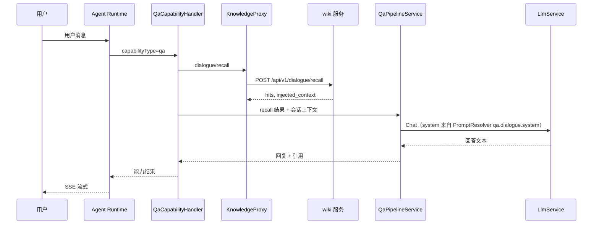

# 问答型能力 — V1 已完成

> 问答型业务能力说明；**以现网实现为准**。

---

## 1. 能力定位

- 基于 **wiki 知识库**内容回答解释类、说明类、指引类请求
- **不**直接查询实时业务数据
- 支持多轮对话与引用依据（经 recall hits 注入）

---

## 2. 固定链路（V1）

**硬约束**：wiki **仅召回**；最终自然语言 **必须**由平台 LLM 生成。

---

## 3. 配置依赖

| 配置项 | 位置 |
|--------|------|
| wiki 服务地址 | 知识库管理 → wiki 连接 / `system_config.knowledge.wikiBaseUrl` |
| 租户 wiki 前缀 | `knowledge_base.wiki_prefix` |
| 平台 LLM | 系统设置 → 模型接入 |
| 问答 system 模板 | Prompt 管理 → `qa.dialogue.system` |

---

## 4. 代码落点

| 组件 | 路径 |
|------|------|
| Handler | `business-capability/qa.handler.ts` |
| Pipeline | `business-capability/qa-pipeline.service.ts` |
| 召回代理 | `knowledge/knowledge-proxy.service.ts` |
| 管理端问答测试 | `business-capability/qa-preview.controller.ts` |
| Prompt key | `qa.dialogue.system` |

---

## 5. 管理端验证入口

| 入口 | API |
|------|-----|
| 知识库 / 问答测试 | `POST /api/v1/knowledge/dialogue/recall`（仅召回） |
| 同上 | `POST /api/v1/knowledge/dialogue/qa-preview`（召回+LLM） |
| 会话调试 | 完整 Runtime |
| 能力演示 / Copilot | `/copilot/v1` |

---

## 6. 实现差异

| 原设计 | V1 现网 |
|----------|---------|
| pathy-knowledge-server | **wiki 知识库服务**（语义相同，配置键不同） |
| recall + 平台 LLM | ✅ 一致 |
| pathy recall-test 非生产路径 | ✅ 未作为验收标准 |

未验收：Skill 相关拦截仍依赖实验中「技能书管理」菜单。

Policy 对问答的拦截与命中留痕见 **规则** 菜单（[`16-规则与Policy.md`](../modules/16-规则与Policy.md)）。
